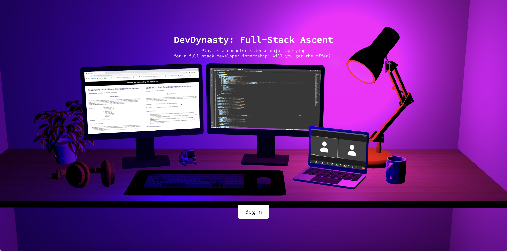
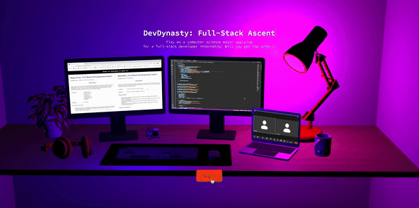
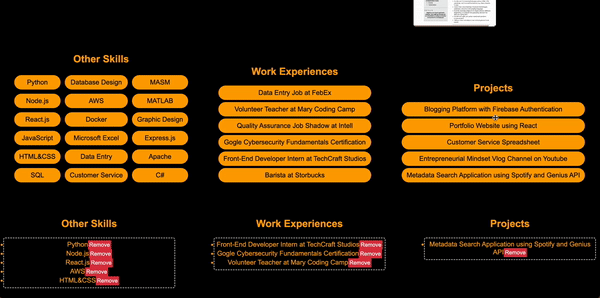
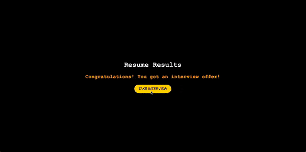
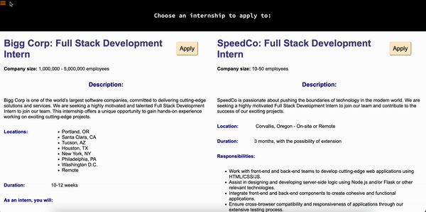
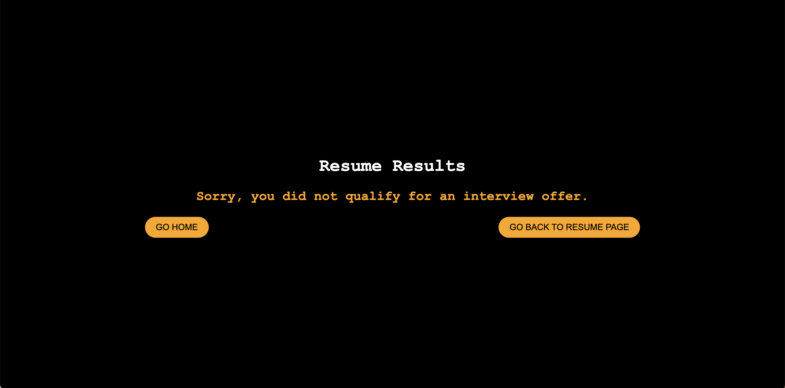
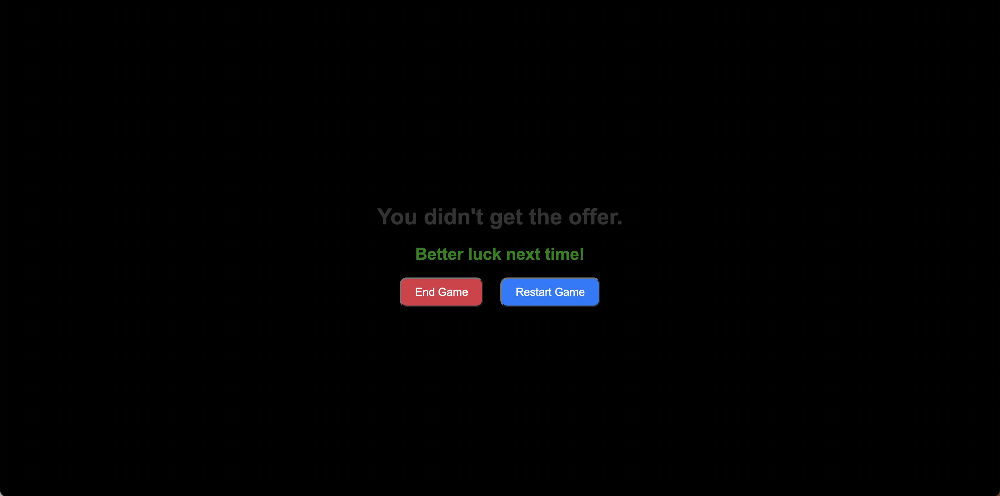
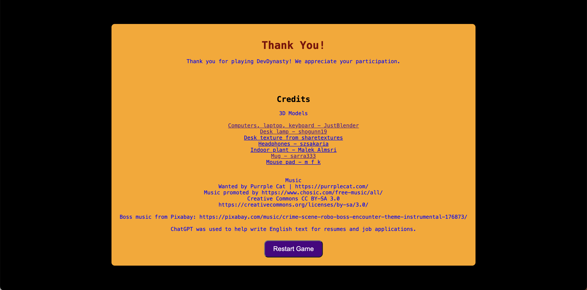

# DevDynasty: Full Stack Ascent 💻📈

Play as a computer science major undergoing the application process for a full stack developer internship! You'll experience resume building, choosing a company to apply to, and an interview. Will you get the offer?!

# CS 290 Final Project

We created this project with an ambitious idea to simulate what we, as CS majors, know all too well: the internship application and interview process. The result is a web game born out of our shared experiences that provides an engaging and low-stakes way for our fellow students to relive the challenging experience. 

# How to Install & Use

1. `clone` repository and `cd` into directory.
2. If you don't already have it, install Node.js.
3. Run:
```bash
npm install
```
4. Then compile scripts and start server by running the following:
```bash
npm start
```
5. Navigate to `http://localhost:8000`. 
6. Good luck! 🖥

# Screenshots

















